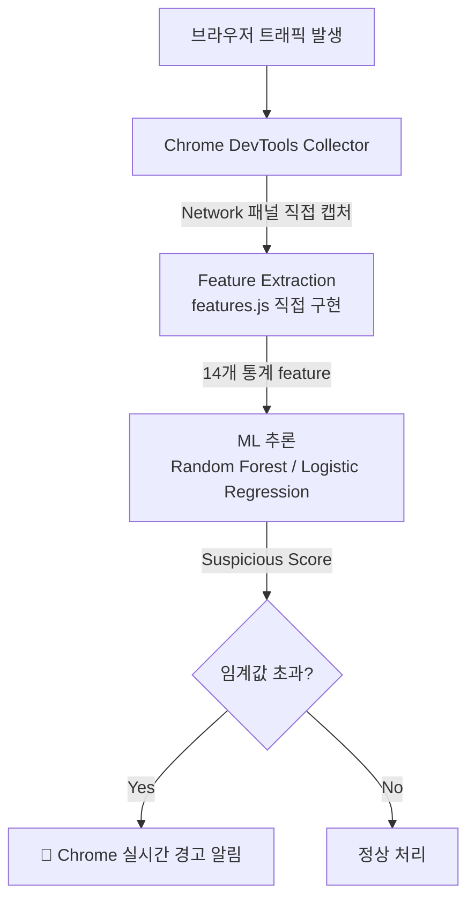

<div align="center">

# 🔍 웹 트래픽 의심 행동 탐지 시스템
### Behavior-based Suspicious Traffic Detection with ML + Chrome Extension

**"패킷 내용을 열어보지 않고, 행동 패턴만으로 악성 트래픽을 탐지할 수 있을까?"**

[](https://python.org)
[](https://scikit-learn.org)
[](https://www.tensorflow.org/js)
[](https://developer.mozilla.org/en-US/docs/Web/JavaScript)
[](https://developer.chrome.com/docs/extensions/)

</div>

---

## 📸 실제 동작 화면

<table>
  <tr>
    <td align="center" width="50%">
      
      <br/><sub><b>🚨 의심 트래픽 탐지 시 Chrome 실시간 경고 알림</b></sub>
    </td>
    <td align="center" width="50%">
      <br/>
      <h3>Random Forest 탐지 성과</h3>

| 지표 | 결과 |
|------|------|
| **Precision** | **1.000** ✅ |
| **False Positive** | **0건** 🎯 |
| **Accuracy** | **98.0%** |
| **F1-Score** | **0.923** |

  <sub><b>정상 트래픽을 단 한 건도 의심으로 잘못 분류하지 않음</b></sub>
    </td>
  </tr>
</table>

> 📁 `docs/screenshots/chrome_alert.png`에 이미지를 추가하면 자동 표시됩니다.

---

## 🎯 핵심 차별화 포인트

| | 일반 탐지 방식 | **이 프로젝트** |
|---|---|---|
| **탐지 기준** | payload 검사 · signature 기반 | **행동 패턴 14개 feature만으로 탐지** |
| **feature 출처** | 기존 데이터셋 활용 | **JavaScript로 추출 함수 직접 구현** |
| **모델 전략** | 단일 모델 사용 | **2개 모델 비교** — 오탐 최소화 vs 미탐 최소화 |
| **서비스 수준** | 분석 결과 출력으로 완료 | **Chrome Extension end-to-end 경고 흐름 구현** |
| **결과** | - | Precision **1.000** · False Positive **0건** |

---

## 🏗️ 시스템 아키텍처



> 트래픽 수집 → feature 생성 → 모델 추론 → 실시간 경고까지 **하나의 흐름으로 연결**

---

## 🧠 핵심 구현

### Feature Engineering — 14개 행동 패턴 직접 설계

payload를 열어보지 않고, 트래픽의 **통계적 행동 특성**만으로 탐지합니다.

| 순위 | Feature | 설명 | 중요도 |
|:---:|---------|------|:------:|
| 1 | `length` | 본문 전체 길이 | **0.214** ⭐ |
| 2 | `kw_fromCharCode` | 난독화 키워드 등장 수 | **0.158** ⭐ |
| 3 | `entropy` | Shannon 엔트로피 (문자 무작위성) | **0.146** ⭐ |
| 4 | `avgLineLen` | 평균 줄 길이 | **0.142** ⭐ |
| 5 | `alphaRatio` | 영문 문자 비율 | **0.110** ⭐ |
| 6 | `symbolRatio` | 기호 문자 비율 | **0.096** ⭐ |
| 7~14 | 기타 8개 | `eval`, `atob`, `iframe` 등 | 0.134 |

> 📌 **상위 6개 feature가 전체 중요도의 86.5% 차지** — behavior-based detection의 유효성 확인

### 모델 전략 — 오탐 vs 미탐 트레이드오프

단순히 하나의 모델을 쓰는 것이 아니라, **탐지 목적에 따른 전략 차이**를 분석했습니다.

| 모델 | Precision | Recall | False Positive | 적합한 상황 |
|------|:---------:|:------:|:--------------:|------------|
| **Random Forest** | **1.000** | 0.857 | **0건** | 오탐 최소화 — 보수적 차단 정책 |
| Logistic Regression | 0.680 | **0.930** | 6건 | 미탐 최소화 — 놓치지 않는 탐지 |

---

## 🔥 Trouble Shooting

### feature 설계 — "어떤 신호가 악성을 구분하는가"

**문제**: payload를 보지 않고 트래픽을 구분하려면 어떤 feature를 써야 할지 기준이 없었음

**접근**: 악성 트래픽의 특성을 도메인 관점에서 역으로 추론
- 난독화 코드는 `fromCharCode()`, `eval()`, `atob()` 같은 키워드를 많이 씀
- 악성 스크립트는 일반 코드보다 엔트로피(문자 무작위성)가 높음
- 길이와 줄 구조가 정상 리소스와 다른 패턴을 보임

**결과**: 직접 설계한 14개 feature로 Precision **1.000** 달성

---

### 클래스 불균형 (정상 87% vs 의심 13%)

**문제**: 의심 트래픽이 전체의 13%에 불과해 모델이 정상으로만 예측하는 경향

**해결**: `class_weight="balanced"` 적용으로 소수 클래스(의심) 가중치 자동 보정

**학습**: 불균형 데이터에서 Accuracy만 보면 안 된다 — Precision/Recall/F1을 함께 봐야 실제 성능을 알 수 있음

---

## 📊 데이터셋

| 항목 | 내용 |
|------|------|
| 총 수집 트래픽 | 4,046건 |
| 학습 데이터 | 506건 |
| 클래스 | 정상(0): 439건 / 의심(1): 67건 |
| 수집 방법 | Chrome DevTools Network 패널 직접 캡처 |

---

## 📁 프로젝트 구조

```
network-traffic-devtools-extension/
├── extension/
│   ├── features.js          # 14개 feature 추출 함수 (직접 구현)
│   ├── predictor.js         # ML 추론 로직
│   ├── collector.js         # DevTools 트래픽 수집
│   └── tfjs_model/          # TensorFlow.js 모델
│
├── training/
│   ├── 01_data_preprocessing.ipynb
│   ├── 02_feature_extraction.ipynb
│   ├── 03_model_export_to_h5.ipynb
│   └── 04_model_comparison.ipynb   # RF vs LR 비교 분석
│
└── README.md
```

---

## ⚠️ 한계 및 개선 방향

| 한계 | 개선 방향 |
|------|-----------|
| 라벨링이 rule 기반 weak labeling에 의존 | 전문가 라벨링 또는 능동 학습 적용 |
| 의심 클래스 비율 낮음 (13%) | 추가 수집 + SMOTE 오버샘플링 |
| 정교한 공격 유형 구분 한계 | 시계열 feature 추가 (요청 간격·빈도 패턴) |

---

<div align="center">

**📬 문의는 GitHub Issues 또는 [rkdwl3264@naver.com](mailto:rkdwl3264@naver.com)으로 남겨주세요**

[](https://github.com/rkdwltn1211)

</div>
